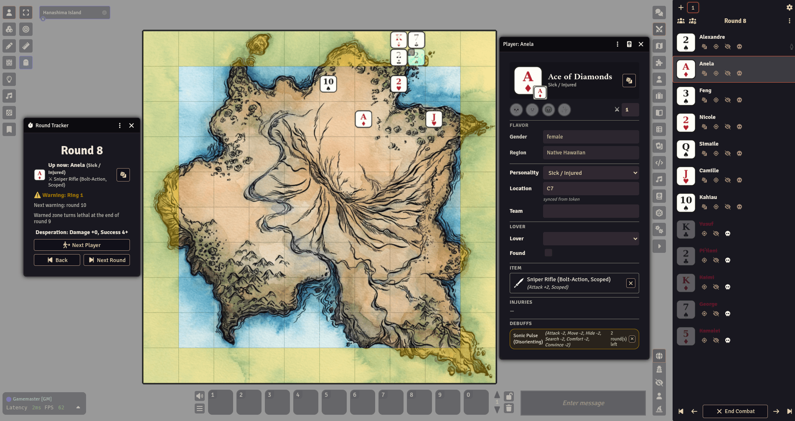
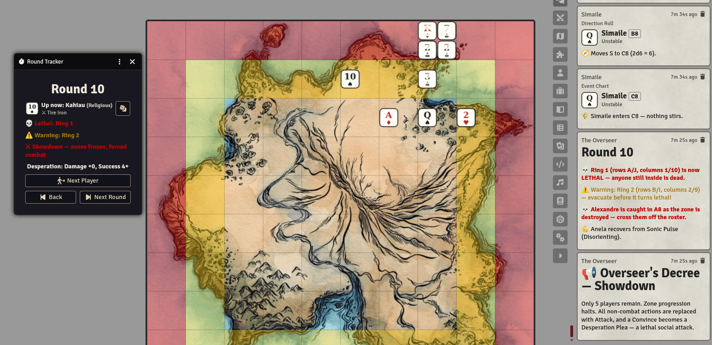
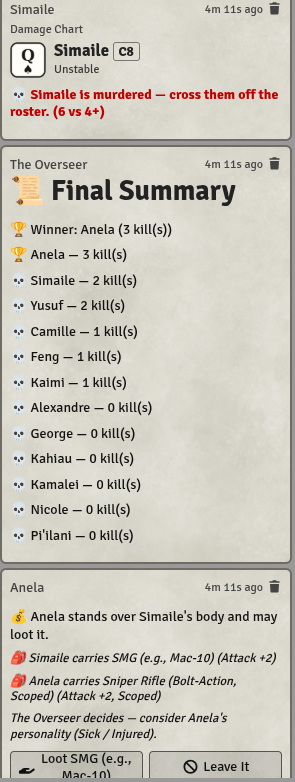

# Battle Royale (FoundryVTT Game System)

A solo RPG where you play the Overseer running a battle to the death: up to 52
"players" — one per playing card (2–A of ♥♦♠♣) — fight for survival on
**Hanashima Island**, a 10×10 grid. This system automates the book's setup,
dice, and bookkeeping so you can run a game solo, at speed, inside Foundry.

- **Foundry compatibility:** v13 minimum, verified on v14.

## Get the book

This is the companion Foundry system for **Battle Royale — A Solo RPG** by
Craig Smith. Grab the rules at
**[zombiecraig.itch.io/battle-royale-solo-rpg](https://zombiecraig.itch.io/battle-royale-solo-rpg)**
— the full rulebook also ships inside the system as an in-Foundry Journal
(see Features below), so you can reference it without alt-tabbing.

## Screenshots







## Install

1. In Foundry: **Game Systems → Install System**.
2. Paste this **Manifest URL**:
   ```
   https://github.com/zombieCraig/foundryvtt-battle-royale/releases/latest/download/system.json
   ```
3. **Install**, then create a world using **Battle Royale**.

## Features

- **Battle Royale Rulebook journal** — the book's rules text (Requirements
  through Death) built in as a browsable, searchable in-Foundry Journal, with
  links out to the Items compendium.
- **Hanashima Island** scene, ready to play on world launch: the shipped map,
  gridded and aligned, activated automatically.
- **Game Setup wizard** (book pp.2–6, macro or `Game Setup`): pick player
  count (Random 12 / Face cards / Full deck / custom), gender mode, region,
  and diversity level. Deals unique cards, rolls names/genders/personalities,
  creates the roster, pairs up Lovers, rolls starting backpack items, and
  rolls the Waking Up scene into chat. Re-run anytime to reset and replay.
- **Dispersal placement** (book p.7) — after Waking Up, players are
  auto-placed on the island per the scene's Dispersal Method (Roll Call,
  Centralized, or Dispersed), water rolls re-rolling to a safe cell.
- **Round tracker + shrinking zones** (auto-opens, or `Round Tracker` macro):
  tracks the round (1–30), zone warnings/lethal rings, and the Desperation
  Escalation bonus. **Next Round** advances everything — warned/lethal zones
  tint the map, anyone caught in a lethal zone dies automatically, and
  **Back** rewinds cleanly (except zone deaths, which you un-kill by hand).
- **Shuffled turn order** every round, driven by the core combat tracker —
  dead players sink to the bottom and are skipped.
- **Action rolls** (`Roll Action` macro, or a button on the tracker/sheet):
  rolls the player's personality-specific action die, then chains into
  Success Rolls and the right follow-up (Move's direction roll, Overseer's
  random pick, etc.) with its own themed 3D dice faces via
  [Dice So Nice](https://foundryvtt.com/packages/dice-so-nice).
- **Full action set, automated**: Move (with auto-pathing around water/lethal
  zones), Comfort, Hide, Search, Attack, Convince, Abandon, Mimic, and
  Overseer's random action — each resolves the book's opposed rolls, bonuses,
  and outcomes with one button.
- **Combat & injuries** — opposed attack rolls with weapon/teammate/lover/
  cover bonuses, Multi-Target and Area Affect weapons, a Damage Roll that
  kills or sends the loser to the Injury Table, and automatic Attack/Move/
  Hide/Search penalties while injured.
- **Items** — the full d100 Items Table ships as the **Battle Royale Items**
  compendium (98 items). Drag onto a sheet to equip (one item at a time);
  bonuses apply automatically in combat and success rolls. Looting the dead
  and losing a Search both prompt in chat.
- **Teams, Lovers, and social actions** — Convince merges players onto teams
  (which then move and fight together); Comfort heals injuries or grants
  Morale; a Lover's death enrages their partner; all fully automated per the
  book's rules.
- **Event Chart** (book pp.21–22) — every completed move rolls uneventful /
  structure flavor / a hostility attack / an environmental hazard, including
  timed debuffs and multi-round traps like Quicksand.
- **Endgame** — Overseer's Decree/Showdown at 5 players, Overseer's
  Impatience necklace detonations, Final Team saves, the Final Reckoning
  duel at 2 players, Final Day at round 30, and a Game Over summary card with
  every player's kill count.

## Credits

**Battle Royale — A Solo RPG** and this Foundry system are by Craig Smith
(Hacktop Studios), with art by Lisa Jiang. Get the book at
[zombiecraig.itch.io/battle-royale-solo-rpg](https://zombiecraig.itch.io/battle-royale-solo-rpg).

## License

Licensed under **CC BY-SA 4.0**, the same license as the book — see
[`LICENSE.md`](LICENSE.md). You're free to share and adapt, with attribution
and ShareAlike.

## Development

Built in a private monorepo — see [`DEVELOPMENT.md`](DEVELOPMENT.md) for the
build/release workflow if you have contributor access.
